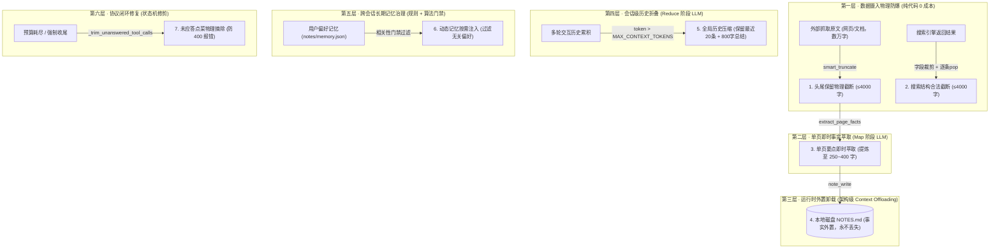

# Agent 上下文工程与截断压缩手册 (Context Engineering & Compaction Handbook)

> **导读**：在自主智能体（Agent）长时间运行、多轮循环、频繁调用工具的过程中，**“上下文爆炸”** 与 **“注意力衰退（Context Rot）”** 是摧毁 Agent 稳定性和拉垮预算的最核心痛点。
>
> 本项目没有依赖任何第三方 Agent 框架黑盒，而是从底层纯原生构建了一套**分层递进的上下文工程与控容体系**。本文档详细拆解系统中全部截断与压缩机制的**触发时机、实现方案、截断规则、压缩效果、设计目标与代码位置**，供学习与二次开发查阅。

---

## 🗺️ 全局压缩体系架构全景



---

## 🔍 七大截断与压缩方案深度剖析

---

### 方案 1：单次工具返回头尾保留物理截断 (`smart_truncate`)

* **🎯 截取时机**：
  在 `fetch_url`（网页静态抓取）、`fetch_js`（无头浏览器动态抓取）、`note_read`（笔记读取）工具将结果序列化为 JSON 返回给 Agent 前触发。
* **🛠️ 截取方案**：
  **纯 Python 字符串物理切片**（非 LLM，执行时间 $\approx 0.001\text{ms}$，消耗 0 Token）。
* **📏 截取规则**：
  1. 设定最大单次返回字符上限 `MAX_TOOL_RESULT_CHARS = 4000`（在 [`config.py`](./config.py) 中配置）；
  2. 若文本长度 $\le 4000$，原样放行；
  3. 若文本长度 $> 4000$，按 **前 70%（约 2800 字符）+ 占位符 `\n……[中间内容已截断]……\n` + 尾部 30%（约 1200 字符）** 拼接。
* **📊 截取效果**：
  * 将动辄 30,000~100,000 字的长篇网页强制压缩到 4000 字安全区间内；
  * **压缩比**：可达 85% ~ 96%；
  * **开销**：0 成本，极速。
* **🎯 截取目标**：
  * **首道防线**：防止未知网络异常或单篇超长 HTML 直接爆破模型上下文，也保护下游的 Map 萃取模型；
  * **防切定价表/结论**：普通从头切断（`text[:4000]`）会把网页底部的 **Pricing 价格表、FAQ、联系方式、页脚声明** 切掉，头尾保留可保住尾部高价值事实。
* **💻 核心代码**：
  * [`common/tools.py`](./common/tools.py) 的 `smart_truncate()` 与 `fetch_url()`

```python
def smart_truncate(text: str, limit: int, tail_ratio: float = 0.3) -> str:
    """头尾保留截断：定价表/页脚/联系方式等高价值信息常在页面中后部，
    纯头部截断会切掉。保留前 (1-tail_ratio) 与尾部，中间以标记衔接。"""
    if len(text) <= limit:
        return text
    marker = "\n……[中间内容已截断]……\n"
    head = int(limit * (1 - tail_ratio)) - len(marker)
    tail = limit - head - len(marker)
    if tail <= 0:
        return text[:limit]
    return text[:head] + marker + text[-tail:]
```

---

### 方案 2：单页即时事实萃取（Map 阶段 `extract_page_facts`）

* **🎯 截取时机**：
  在 [`common/tools.py`](./common/tools.py) 的 `dispatch()` 中，当 `fetch_url` 或 `fetch_js` 抓取成功且正文长度超过阈值 `PAGE_EXTRACT_THRESHOLD = 800` 字符时即时触发。
* **🛠️ 截取方案**：
  **轻量 LLM Prompt 驱动的智能要点萃取**（Map-Reduce 范式之 Map 阶段）。
* **📏 截取规则**：
  1. 仅截取与当前课题 `goal` 相关的高信噪比事实；
  2. 提取所有数字、价格、时间、规格、商业模式与核心结论；
  3. 彻底剔除网页导航栏残留、版权说明、免责声明、备案号及社交媒体推广；
  4. 严格忠于原文，严禁脑补；
  5. 强制输出格式为 Markdown 列表，长度限制在 **$\le 400$ 字**。
* **📊 截取效果**：
  * 抓取的 2000~4000 字正文经过提纯，收敛为 250~400 字的精纯事实卡片；
  * **单页压缩比**：稳定在 **75% ~ 90%**；
  * **Token 归属**：产生的 Prompt 与 Completion Token **100% 计入用户会话预算**，并在 UI 标记 `[Map萃取]` 徽章。
* **🎯 截取目标**：
  * 解决“长文倾倒（Context Flooding）”：让主 Agent 大脑只接触“蒸馏后的纯净事实”，极大降低主 Agent 的注意力损耗，避免幻觉。
* **💻 核心代码**：
  * [`common/context.py`](./common/context.py) 的 `extract_page_facts()`
  * [`common/tools.py`](./common/tools.py) 的 `dispatch()`

---

### 方案 3：搜索结果字段裁剪与结构保护（`web_search`）

* **🎯 截取时机**：
  在 `web_search()` 工具执行搜索（Tavily 或 DDGS 降级通道）返回多条结果后触发。
* **🛠️ 截取方案**：
  **纯 Python 字段字符串切片 + 列表条目逐个弹出（`pop`）**（非 LLM）。
* **📏 截取规则**：
  1. **标题截断**：每条搜索结果的标题只保留前 100 字符（`title[:100]`）；
  2. **摘要截断**：每条搜索结果的正文只保留前 300 字符（`snippet[:300]`）；
  3. **结构保护**：将列表序列化为 JSON 字符串，若 `len(json_dump) > MAX_TOOL_RESULT_CHARS`，**从末尾逐条弹出条目（`trimmed.pop()`）**，绝不进行半截强行切断。
* **📊 截取效果**：
  * 保证返回给模型的 JSON 文本总长度永远 $\le 4000$ 字符；
  * 搜索条目数通常精简为 3~5 条高价值条目。
* **🎯 截取目标**：
  * 协议合法性保护：杜绝因字符超长直接切断导致 JSON 尾括号断裂、引发模型解析 400 错误的恶性故障；
  * 去除搜索引擎返回的超长低信噪比冗余。
* **💻 核心代码**：
  * [`common/tools.py`](./common/tools.py) 的 `web_search()`

---

### 方案 4：多轮交互历史全局折叠压缩（Reduce 阶段 `compact_messages`）

* **🎯 截取时机**：
  在 Agent 主循环的每一步调用后，检查 `prompt_tokens > MAX_CONTEXT_TOKENS`（如当前设置为 100 万窗口的 60% = 600,000 tokens 时触发；快问/标准档位也受各预算门禁协同防护）。
* **🛠️ 截取方案**：
  **输入预剪裁 + LLM 全量归纳（Reduce）+ 纯代码安全切分重组**。
* **📏 截取规则**：
  1. **切分点防孤儿保护（`_safe_split`）**：
     保留开头 `system` 消息，切出旧历史 `old` 与最近保留区 `recent`（保留最近 `COMPACT_KEEP_RECENT = 20` 条）。如果切分点恰好落在 `role: tool` 消息上，向前滑动，**确保保留区不以 tool 消息开头**（防止脱离 `tool_calls` 上级变成孤儿导致 API 400）。
  2. **输入预剪裁（`render_messages_for_summary`）**：
     送进总结模型前先去粗取精：
     * 模型决策参数截断：`arguments` 仅取前 200 字符（`args[:200]`）；
     * 模型发言截断：`assistant.content` 仅取前 800 字符；
     * 工具返回截断：`tool.content` 仅取前 500 字符。
  3. **四要素归纳 Prompt**：
     要求摘要必须且仅保留：① 原始任务目标；② 全部关键发现（带来源和具体数据）；③ 尚未完成的事项；④ 任何约束与注意点。总长限制 $\le 800$ 字。
  4. **上下文注入结构**：
     ```python
     [system 提示词]
     + [user: "[历史压缩摘要——此前研究进展]\n{summary}\n\n请基于以上进展继续研究。"]
     + [最近 20 条原始完整交互]
     ```
     > **注意**：此处注入为 `role: user`，切忌人造伪造 `role: assistant`，否则在 DeepSeek 等思考模型下因缺少 `reasoning_content` 会被 API 拒绝。
* **📊 截取效果**：
  * 将几十轮交互（几十万 Token 的调用轨迹与长工具内容）折叠压缩成一条几百字的精简要点；
  * **压缩比**：90% ~ 98%；
  * 上下文使用量瞬间回落，给后续轮次留出充足空间。
* **🎯 截取目标**：
  * **对抗 Context Rot（上下文衰退）**：模型在超长上下文中对早期指令和早先搜出的事实召回率急剧下降，折叠后核心信息重新被提至焦点区；
  * **节约重复计费**：避免在循环中每一轮都为早已过去的几万字垃圾日志全额买单。
* **💻 核心代码**：
  * [`common/context.py`](./common/context.py) 的 `compact_messages()` 与 `_safe_split()`

---

### 方案 5：外置记忆卸载机制（Context Offloading 到 `NOTES.md`）

* **🎯 截取时机**：
  贯穿 Agent 研究的生命周期：Agent 每次调用工具获取到有效数据、或完成大纲子问题查证后，自主调用 `note_write` 沉淀。
* **🛠️ 截取方案**：
  **架构级“内存到外存”卸载**（磁盘 I/O + 提示词原则指引）。
* **📏 截取规则**：
  1. **写限制**：单次写入内容限制 `content[:2000]`，按时间戳追加至本地独立 Markdown 文件；
  2. **读限制**：读取笔记时同样通过 `smart_truncate` 限制在 4000 字符以内；
  3. **收尾保底**：当步数或预算耗尽触发硬收尾时，系统自动将磁盘笔记全文直接注入给结题 Prompt，若模型生成失败直接拿笔记原文作为报告交付。
* **📊 截取效果**：
  * 彻底把关键事实的保存责任从“易失、昂贵的 LLM 上下文”转移给“无限、廉价的文件系统”；
  * 使得历史上下文哪怕做极度激进的“有损压缩”，也不会造成任何事实遗失。
* **🎯 截取目标**：
  * 实现 Anthropic 所述的 **“桌面收纳原则”**：把工作台上的草稿纸及时收进抽屉，要用时再整洁拿出来，让 Agent 始终在干净的桌面上思考。
* **💻 核心代码**：
  * [`common/tools.py`](./common/tools.py) 的 `note_write()` / `note_read()`
  * [`common/agent_core.py`](./common/agent_core.py) 的 `_build_final_prompt()`

---

### 方案 6：跨会话长期记忆容量管理与相关性门禁（Memory Gating）

* **🎯 截取时机**：
  1. **跨会话持久化时**：任务结束提取偏好时，通过 LLM 语义去重合并进 `notes/memory.json`；
  2. **新任务启动时**：构造初始 `system prompt` 时过滤注入。
* **🛠️ 截取方案**：
  **容量切片（纯代码）+ LLM 语义合并 + 规则与 2-gram 关键词相关性门禁过滤**。
* **📏 截取规则**：
  1. **容量天花板**：记忆库强行截断仅保留最新 20 条（`facts[-20:]`），防止长期使用无限膨胀；
  2. **通用规范 100% 注入**：如“输出语言为中文”、“表格对比格式”、“带来源引用”等全域生效；
  3. **领域偏好动态门禁（Gating）**：
     * 如果偏好涉及“会员定价/收费比价”，而用户当前只问“技术架构”，**100% 剔除，不注入**；
     * 如果偏好涉及“微信认证/资质”，而用户当前问的是汽车，**100% 剔除，不注入**；
     * 仅当实体词或 2-gram 特征交集命中时才允许动态注入。
* **📊 截取效果**：
  * 注入 System Prompt 的偏好从潜在的几十条浓缩为 3~5 条最相关的黄金指令；
  * 既节省了 System 区域的 Token，又使偏好遵循率大幅提升。
* **🎯 截取目标**：
  * **杜绝记忆负迁移**：防止因某次历史会话问了价格，导致后续所有无关课题都被迫输出价格分析。
* **💻 核心代码**：
  * [`common/memory.py`](./common/memory.py) 的 `MemoryStore` 与 `is_domain_preference_relevant()`

---

### 方案 7：历史协议非法未应答调用修剪（`_trim_unanswered_tool_calls`）

* **🎯 截取时机**：
  在预算耗尽（`budget_hard_stop`）、步数超限（`max_steps`）、用户强行点击停止（`user_stop`）等场景触发强制结题时执行。
* **🛠️ 截取方案**：
  **纯 Python 列表逆序扫描与元素修剪**。
* **📏 截取规则**：
  检查 `messages` 列表的末尾。若最后一条消息是包含 `tool_calls` 的 assistant 消息且尚未回填对应的 `role: tool` 回执，**直接将其从上下文末端物理删除**。
* **📊 截取效果**：
  * 消除悬挂调用，使上下文状态回退到上一个合法的“已结清”轮次。
* **🎯 截取目标**：
  * 严格遵循 OpenAI / DeepSeek 协议：在存在未完成的 `tool_calls` 时若直接追加 `role: user` 强行提问，API 会直接抛出 `400 Bad Request` 报错。该修剪是保证系统自愈收尾的关键安全件。
* **💻 核心代码**：
  * [`common/agent_core.py`](./common/agent_core.py) 的 `_trim_unanswered_tool_calls()`

```python
def _trim_unanswered_tool_calls(messages: list):
    """摘除末尾'点了菜但没执行'的 assistant(tool_calls) 消息。
    场景：硬停在模型刚点完菜、还没执行回填的时刻——带着这份非法历史
    去做结题调用会 400。语义：那轮点菜作废，历史回到上一个合法状态。"""
    while messages:
        m = messages[-1]
        if isinstance(m, dict):
            if m.get("role") == "assistant" and m.get("tool_calls"):
                messages.pop()
                continue
        break
```

---

## 📋 七大方案全景对比速查表

| # | 机制名称 | 触发时机 | 方案类型 | 截取规则/阈值 | 典型压缩比 | 核心目标 |
|:---|:---|:---|:---|:---|:---|:---|
| **1** | **头尾保留截断**<br>`smart_truncate` | 单次抓取/读笔记返回前 | **纯代码切片**<br>(0成本/0ms) | 上限 4000 字符<br>留前 70% + 留后 30% | 80%~95% | 物理防爆，保住网页尾部定价与结论 |
| **2** | **单页即时萃取**<br>`extract_page_facts` | 抓取网页正文 $> 800$ 字时 | **轻量 LLM 提纯**<br>(Map阶段) | 剔除废话，只留数据与结论<br>Markdown 列表 $\le 400$ 字 | 75%~90% | 去除 HTML 杂质，向主脑提供高信噪比事实 |
| **3** | **搜索结构保护**<br>`web_search` | 联网检索结果组装时 | **纯代码切片+pop**<br>(0成本/0ms) | 标题100字/摘要300字<br>超长末尾条目逐个 pop | 50%~70% | 规避超长，保障 JSON 闭合语法合法性 |
| **4** | **全局历史折叠**<br>`compact_messages` | 输入 token 超阈值时<br>(如 600K token) | **LLM 全局归纳**<br>(Reduce阶段) | 保留最近 20 条原文<br>旧历史浓缩为 $\le 800$ 字四要素 | 90%~98% | 对抗上下文注意力衰退 (Context Rot)，降低计费 |
| **5** | **外置记忆卸载**<br>`note_write/read` | 调研进行全周期 | **文件系统 I/O**<br>+ Prompt 约束 | 单次写入 $\le 2000$ 字符<br>结题笔记原文兜底 | 空间无限<br>(移出内存) | 事实在磁盘安全落盘，允许上下文放心有损压缩 |
| **6** | **记忆门禁过滤**<br>`MemoryStore` | 会话启动构建 System 时 | **规则 + 2-gram**<br>(0成本/0ms) | 容量锁死 20 条<br>仅注入与当前问题相关的偏好 | 60%~80% | 杜绝无关偏好负迁移与提示词臃肿 |
| **7** | **未结调用修剪**<br>`_trim_unanswered` | 预算用尽/强制结题时 | **纯代码逆序扫描**<br>(0成本/0ms) | 弹出末尾未执行的 `tool_calls` 消息 | 清理非法状态 | 避免未闭合工具调用引发 API 400 崩溃 |

---

## 💡 最佳实践与学习心得

1. **不要一上来就调 LLM 总结**：
   * 面对不可控的互联网数据，**先用纯代码规则做物理截断（方案 1、3）**，把几十万字的极端长文在 0 毫秒内锁死到安全区间；
   * 只有在安全区间内，才让 LLM 去做“高智能的语义萃取（方案 2）”，避免为了总结长文反而把总结模型打崩。
2. **区分“工作台”与“抽屉”**：
   * 上下文是工作台，放不下太多东西；
   * 磁盘文件（`NOTES.md`）是抽屉。随时随地把重要数据写进抽屉，大脑就可以自由进行全局压缩，永远不怕信息遗失。
3. **协议严谨性高于一切**：
   * 截断文本时，必须保证序列化出来的 JSON 语法合法（方案 3）；
   * 截断历史时，切分点绝对不能拆散 `assistant(tool_calls)` 与 `tool` 的配对链条（方案 4）；
   * 强行收尾时，必须修剪掉未应答的调用（方案 7）。
