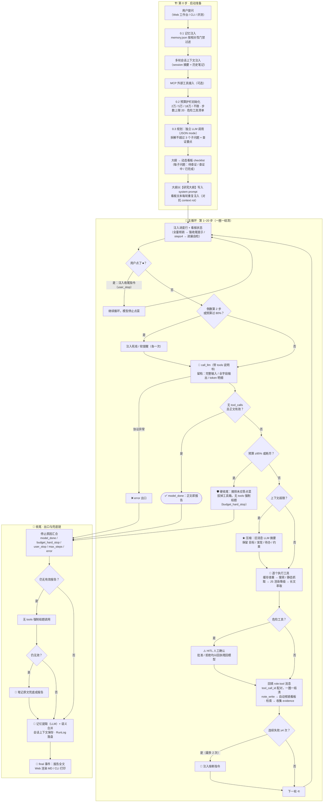

# Sky Research Agent —— 从零手写的深度研究 Agent（附产品经理"干中学"全记录）

> **一句话**：不依赖任何 Agent 框架，用原生 API 从零实现的**深度研究 Agent**——
> 多源检索 / JS 渲染抓取 / 上下文压缩 / 外置记忆 / 人工确认 / 预算护栏 / 多智能体 / 评测与可观测，每个节点可解释、可修改、可观测。
> 本仓库同时是一份完整的**产品经理"干中学"记录**：从第一行代码到评测调优，全过程方案、数据与踩坑保留（见下方学习路径）。
> 方法论依据：Anthropic《Building Effective Agents》+ OpenAI《A Practical Guide to Building Agents》+ HumanLayer《12-Factor Agents》+ HuggingFace AI Agents Course。

## 这是什么？

一个**深度研究 Agent**：你提一个研究问题，它自主完成

```
规划(JSON大纲) → 多源检索 → 网页深读(含JS渲染) → 笔记沉淀
→ 上下文压缩 → 交叉验证 → 带引用的结构化报告
```

全程**实时可视**（每个动作有编号、可下钻看输入输出与用时）、**有安全边界**（预算硬收尾、失败熔断、危险操作人工确认）、**可评测**（12 题 LLM-as-judge 基线 0.68 → 0.76，调优全程有数据）。

它没有用任何 Agent 框架——所有机制（工具调用、循环、压缩、记忆、护栏）都是原生实现，因此**每个环节你都能看懂并能改**。

## 功能特性

- 🔬 **深度研究流水线**：JSON 大纲规划（plan 节点）与动态任务核销看板（Dynamic Todo Checklist）→ 多源检索（摘要优先 + Tavily 优先/免费引擎降级）→ 会话级搜索去重与防重抓取 → 静态+SPA 自动无缝降级无头浏览器抓取 → 单页 Map-Reduce 即时萃取 → 笔记沉淀与信源冲突交叉核验 → 待办清零强收尾门禁 → 带引用结构化报告
- ⚡ **搜索去重与防重拉取**：会话级 `SessionToolCache`——精确匹配 0ms 秒回；模糊相似度（$\ge 75\%$）注入引导建议防原地踏步；已访问 URL 缓存杜绝重复网络请求与反爬 429；域名级失败与反爬感知（失败 $\ge 2$ 次自动引导改道）
- 🧠 **双层上下文工程**：单页 Map 即时事实萃取（长网页进门提炼 80%+）+ 历史全局压缩（compaction，用量 100% 计入预算，阈值 = 窗口 × 60%）+ 外置笔记记忆——**生命周期**：发现随手写入磁盘笔记（不受压缩影响）→ 压缩丢弃过程、结论安全在磁盘 → 收尾时读回全量笔记成文（硬收尾时直接嵌入兜底）；长任务 token 稳按在几千级，事实永不丢
- 💾 **跨会话记忆与相关性门禁**：LLM 语义合并的偏好记忆（同义去重、冲突以新为准）；通用偏好（输出语言/表格/引用规范）全域生效，领域偏好（定价/合规/细分业务）意图与实体相关性门禁过滤（Relevance Gating），彻底杜绝记忆负迁移
- 🔁 **多轮研究会话**：同一话题持续追问、逐步深入——笔记续跑（不重复检索已沉淀事实）+ 上下文延续（上轮摘要/发现注入下轮 system）+ 指代追问；Web 端时间线按轮拼接完整保留（"第 N 轮"用户输入卡片 + 每轮执行流，点击历史即整会话还原，刷新自动恢复）；SSE 心跳 + 断点续传自动重连，长任务实时视图不断流
- 🛡️ **安全件与协议自愈**：预算三水位（95% 拔工具箱硬收尾 + 磁盘笔记注入 + DSML 标签净化 + 笔记原文兜底）、未应答 tool_calls 协议自愈修复（防 400）、危险操作人工确认（HITL，接入 MCP 写类工具时生效）、失败熔断、阶梯式巡航自检与充分度收敛门禁（主干有据即止，坚决杜绝原地漫游）、动态看板全量核销自发结题
- 🤖 **多智能体**：拆题 → 并行 worker（各持独立缓存与萃取流水线）→ 汇总（实测 2.5x 提速），诚实验收沿责任链传导
- 📊 **评测与可观测**：12 题 LLM-as-judge 基线、四维评分、失败归类、观测面板、层级编号执行流（含 Plan 大纲卡片、动态 Checklist 任务看板、缓存命中徽章与萃取提纯徽章）
- 🔌 **MCP 客户端**：一行配置接入外部 MCP server 工具生态（写类工具自动纳入人工确认）

## 🗺️ 全流程图：规划 → 主循环 → 收尾（Harness 框架全景）

对应内核 `common/agent_core.py` 的 `run()`。节点编号与工作台执行流事件一一对应（0.1 记忆 / 0.2 预算 / 0.3 规划 …），每个节点在 Web 端都可展开看完整输入输出。



> 查看器不渲染 Mermaid 时可直接看导出图：[docs/flowchart.png](docs/flowchart.png)

**Harness = 依赖注入**：内核只有一份（`common/agent_core.py`），五种 IO 全部由宿主注入——同一内核跑在两种宿主上：

| 注入点 | CLI 宿主 | Web 工作台宿主 |
|---|---|---|
| `emit`（事件流） | 终端打印 | SSE 队列 + 事件落盘（历史可回放） |
| `approver`（危险操作确认） | 终端 y/n | 网页「批准 / 拒绝」按钮 |
| `stop_check`（中止） | — | ⏹ 中止按钮 |
| `budget_max`（预算档位） | 环境变量 | 前端四档选择 |
| `session`（多轮会话） | 可选 | SessionStore 自动管理 |

> 设计要点：收敛（全量核销强收尾、预算硬收尾）、熔断、死线注入全部是**代码态物理约束**，不依赖提示词自觉——"物理约束 > 行为请求"贯穿全图。

## 快速开始

### 环境要求

- Python 3.10+（开发环境 3.12）
- 任一支持 Tool Calling 的模型 API（本项目用 DeepSeek，OpenAI/GLM/Qwen 等兼容协议均可）
- 可选：Node.js（MCP server 需要）、[Tavily](https://tavily.com) API key（搜索质量更好，免费额度够用）

### 方式一：一键启动（推荐）

```bash
git clone https://github.com/skyzizhu/sky-agent-mvp-stu.git
cd sky-agent-mvp-stu
cp .env.example .env        # 编辑 .env，填入 LLM_API_KEY（必填）等配置
./start.sh                  # 自动建环境/装依赖/启动/打开浏览器
./stop.sh                   # 不用了就停止
```

`start.sh` 会自动完成：创建 `.venv` 虚拟环境 → 安装依赖（首次 1-2 分钟）→ 检查 `.env` 配置 → 后台启动服务并健康检查 → 打开浏览器。重复执行也安全（已在运行就直接打开页面）。

### 方式二：手动安装（想了解每一步，或一键脚本在你的机器上不顺）

```bash
git clone https://github.com/skyzizhu/sky-agent-mvp-stu.git
cd sky-agent-mvp-stu
python3 -m venv .venv && source .venv/bin/activate    # Windows: .venv\Scripts\activate
pip install -r requirements.txt
playwright install chromium                          # 可选：fetch_js 工具需要（约 150MB）
cp .env.example .env                                 # 填入下表配置

# 启动工作台
python -m uvicorn webapp.app:app --host 127.0.0.1 --port 7870
# 浏览器打开 http://127.0.0.1:7870
```

### 配置 .env

| 变量 | 必填 | 说明 |
|---|---|---|
| `LLM_API_KEY` | ✅ | 模型 API key |
| `LLM_BASE_URL` | ✅ | API 地址（如 `https://api.deepseek.com`） |
| `LLM_MODEL` | ✅ | 模型名（须支持 tool calling，如 `deepseek-flash`） |
| `TAVILY_API_KEY` | 推荐 | 搜索质量显著提升；未配置自动降级免费引擎 |
| `MCP_SERVERS` | 可选 | MCP server 配置（JSON 数组），接入外部工具生态 |
| `LOW_BUDGET` | 可选 | `1` = 小预算演示模式（验证护栏行为） |

## 使用方式（三种入口 + 评测）

### 1️⃣ 研究工作台（推荐）

```bash
./start.sh                  # 一键启动（详见"快速开始"）；停止: ./stop.sh
# 浏览器打开 http://127.0.0.1:7870
```

输入研究问题（可选四档预算：快问 2 万/标准 5 万/深度 12 万/不限）→ 实时观看层级编号执行流（每颗粒可展开看全量输入输出与用时）→ 危险操作弹窗确认 → 获得 MD 渲染的带引用报告 → 左栏历史点击可回放任意一次运行的完整过程。

### 2️⃣ 命令行

```bash
python stages/08_production/production_agent.py "对比 Notion 和飞书知识库免费版的差异"
```

### 3️⃣ 交互实验室

```bash
python -m uvicorn playground.app:app --port 7860
# 表单构造任意请求，看模型返回的原始 JSON——学习 tool_calls/finish_reason/usage 的最佳场所
```

### 4️⃣ 评测基线

```bash
python evals/run_eval.py --n 3    # 快速验证
python evals/run_eval.py          # 全量 12 题（正式基线）
```

## 📚 核心文档导航（学习材料体系）

| 文档 | 内容 | 何时看 |
|---|---|---|
| [realize.md](./realize.md) | **系统实现图纸**：13 个大节点 × 小节点全景——做什么/技术/目标/衔接/注意，含数据流图与产品决策映射 | 想看"整套系统怎么串起来"、对外讲解架构时 |
| [AGENT_NODES.md](./AGENT_NODES.md) | **节点详解手册**：节点 0–21 的目标/作用/做法/输入/输出/注意点，含全局架构图 | 学每个节点前预习、复习时对照 |
| [CONTEXT_COMPACTION.md](./CONTEXT_COMPACTION.md) | **上下文工程与压缩手册**：7 大截断与压缩机制全景——时机/方案(LLM与代码)/规则/效果/目标，含对比速查表与架构流图 | 研究上下文控容、对抗 Context Rot、设计工具返回格式时 |
| [PITFALLS.md](./PITFALLS.md) | **60 条踩坑清单**：各节点易错问题 → 造成的状况 → 最终效果 → 解决方案 | 写代码前后对照检查；面试备战 |
| [notes/](./notes/) | 10 个阶段的复盘笔记（含踩坑实录与实测数据） | 每阶段结束时回顾 |
| [evals/](./evals/) | 评测集（12 题）+ LLM-as-judge + 三方对比实验报告 | 任何改动前后跑回归 |
| [playground/](./playground/) | 交互式 LLM 实验室：表单构造请求、原始响应展示、思考模式开关 | 研究字段/参数行为时 |
| [observatory/index.html](./observatory/index.html) | 运行观测面板：成功率、token 账单、失败分布、运行历史 | 日常查看 agent 健康度 |

> 阅读顺序建议：本 README（方案）→ AGENT_NODES.md（原理）→ 边写代码边查 PITFALLS.md（避坑）。

---

## 一、先建立心智模型：Agent 到底是什么

### 1. 一句话定义

**Agent = LLM + 工具 + 循环（Loop）+ 停止条件。**

Anthropic 的经典区分（务必先记住，这是整个学习的主线）：

| | Workflow（工作流） | Agent（智能体） |
|---|---|---|
| 谁决定流程 | **代码**：预定义的固定路径 | **LLM 自己**：动态决定下一步做什么、用什么工具 |
| 适用场景 | 任务可拆解、路径可预知，要可预测性 | 开放式问题，步骤数无法预知 |
| 代价 | 延迟换准确率 | 成本高、错误会累积 |

### 2. Agent 的核心循环（你将在 Stage 2 亲手实现）

Claude Agent SDK 文章的表述最精炼：

```
收集上下文 (gather context)
   ↓
采取行动 (take action —— 调用工具)
   ↓
验证结果 (verify work —— 拿到环境返回的"真实反馈")
   ↓
重复，直到模型认为任务完成 / 达到停止条件
```

用代码表示只有十几行：

```python
import json
from openai import OpenAI

client = OpenAI()  # 任何兼容 API 都行：DeepSeek / Qwen / GLM / OpenAI / Claude...

TOOLS = [{
    "type": "function",
    "function": {
        "name": "web_search",
        "description": "搜索互联网，返回结果标题、链接和摘要。",
        "parameters": {
            "type": "object",
            "properties": {"query": {"type": "string", "description": "搜索关键词"}},
            "required": ["query"],
        },
    },
}]

def web_search(query: str) -> str:
    ...  # 你的实现：调搜索 API，返回文本

messages = [
    {"role": "system", "content": "你是一个严谨的研究助理，回答必须基于搜索结果并给出引用。"},
    {"role": "user", "content": "帮我调研一下 XX 赛道的竞争格局"},
]

for step in range(20):                          # 停止条件①：最大轮数（防失控/防烧钱）
    resp = client.chat.completions.create(model="...", messages=messages, tools=TOOLS)
    msg = resp.choices[0].message
    messages.append(msg)
    if not msg.tool_calls:                      # 停止条件②：模型不再要求调工具 = 认为做完了
        print(msg.content)                      # 最终回答
        break
    for tc in msg.tool_calls:                   # 执行模型选择的工具
        args = json.loads(tc.function.arguments)
        result = web_search(**args)
        messages.append({"role": "tool", "tool_call_id": tc.id, "content": result})
    # 回到循环开头：模型看到工具结果，决定下一步
```

**这就是 agent 的全部骨架。** 后面所有高级概念（规划、反思、多智能体、记忆、人工确认）都是在这个循环上做的增强。

### 3. 三个权威来源的核心观点（先读摘要，动手前再读原文）

- **Anthropic《Building Effective Agents》**：能 workflow 就不要 agent，从最简单的方案开始；工具设计（ACI，Agent-Computer Interface）花的功夫甚至要多过主 prompt；给模型足够的空间思考。
- **OpenAI《A Practical Guide to Building Agents》**：三大地基 = 能干的模型 + 定义清晰的工具 + 结构化的指令；编排上从单 agent 起步，复杂了再上 manager 模式（一个主 agent 调度多个专家 agent）；护栏（guardrails）和人工介入是生产必备。
- **12-Factor Agents**：agent 本质是普通软件；"提示词 + 一袋工具 + 循环跑到完"的朴素做法上不了生产；**拥有你自己的 prompt、context window 和控制流**（别让框架替你写），失败信息要压缩后喂回上下文让模型自我纠错。

---

## 二、做什么 Agent？—— 推荐：**PM 深度研究助理（Deep Research Agent）**

### 为什么是这个类型

选 agent 类型的标准：① 技术覆盖面全；② 你自己真的会用（干中学的关键是每天用）；③ MVP 门槛低、不需要后端和第三方系统对接。

| 候选类型 | 覆盖的概念 | 对 PM 的价值 | MVP 门槛 | 结论 |
|---|---|---|---|---|
| **深度研究助理** | 全部（见下） | 高：竞品分析、行业调研、写 PRD 前的资料收集、用户反馈综述 | 低：纯对话 + 搜索 | ✅ **选它** |
| Coding Agent | 验证闭环好（测试即验证） | 中 | 高：需要工程环境 | ❌ 太重 |
| 客服 Agent | 路由、护栏、HITL 好 | 高 | 高：需对接订单/工单系统 | ❌ 对接难，可作为后期"想象扩展" |

深度研究助理是 Anthropic 自家多智能体研究系统的同款架构（他们公开过完整工程复盘），每一个阶段的知识点都有权威文章对照；而且它天然是你日常工作的生产力工具——**学完的那天它就进你的工作流**。

### 概念覆盖对照表（这是本方案的地图）

| Agent 核心概念 | 在研究助理中体现为 | 学习阶段 |
|---|---|---|
| LLM 基础（messages / token / 参数） | 与模型对话 | Stage 0 |
| Function Calling / 工具调用 | search、fetch 等工具 | Stage 1 |
| **Agentic Loop / 停止条件** | 循环调研直到结论可信 | Stage 2 ★核心 |
| System Prompt / 角色设定 | "严谨的研究员"人设 | Stage 3 |
| **ACI / 工具设计** | 搜索结果怎么裁剪、返回什么字段 | Stage 3 |
| **上下文工程**（截断/压缩/just-in-time） | 长调研撑爆上下文窗口 | Stage 4 |
| 结构化输出与任务看板 | 带引用的报告 / JSON 大纲 / 动态核销看板 | Stage 5 |
| **Evals 评测**（LLM-as-judge） | 20 道研究题的评分集 | Stage 5 |
| 规划（Plan-then-Execute）/ 反思（Evaluator-Optimizer） | 先列研究大纲→评审→再执行 | Stage 6 |
| Workflow vs Agent 的体感 | 对比"固定管道"和"自由循环" | Stage 6 |
| **Orchestrator-Workers 多智能体** | 主 agent 拆题，子 agent 并行搜索 | Stage 7 |
| 记忆（Memory）/ 结构化笔记 | 跨会话记住你的偏好、研究领域 | Stage 8 |
| Human-in-the-Loop | 执行前人工确认、关键决策暂停 | Stage 8 |
| Guardrails 护栏 | 轮数/费用上限、工具白名单 | Stage 8 |
| 可观测性（Tracing） | 每一步的完整 trace 日志 | Stage 9 |
| 框架 / MCP | 用框架重写对比；工具包成 MCP server | Stage 10 |

---

## 三、技术选型（刻意保持最小）

| 项 | 选择 | 理由 |
|---|---|---|
| 语言 | Python 3.10+ | 生态最省事，示例最多 |
| 接模型 | 任何支持 tool calling 的 Chat Completions 兼容 API：DeepSeek / Qwen(DashScope) / GLM / OpenAI / Claude / Gemini，用 `openai` SDK 即可接入前三个 | 关键能力是 **tool calling**；先用便宜的模型，跑通后再换强模型对比 |
| 搜索工具 | 免费起步：`duckduckgo-search`；效果好：Tavily / Serper / 博查（国内） | Stage 3 才需要，注册个 key 就行 |
| 网页抓取 | `httpx` + `trafilatura`（正文抽取） | 几行代码 |
| 框架 | **前 9 个阶段完全不用框架** | 12-Factor 与 Anthropic 的共同建议：框架的抽象会遮住 prompt 和循环，出问题难调试，自己写一遍才学得到东西；Stage 10 再用框架重写做对比 |
| 记录 | 每次运行把完整 messages 存成 JSONL 到 `traces/` | 可观测性的最朴素形态 |

仓库实际结构（每个阶段一个文件夹，老代码不动，新代码复制演进）：

```
agent-mvp-stu/
├── README.md            # 本方案（学习路线图）
├── AGENT_NODES.md       # 节点详解手册（节点 0-21，原理+避坑）
├── CONTEXT_COMPACTION.md # 上下文工程与压缩手册（7大截取方案与规则）
├── PITFALLS.md          # 60 条踩坑清单（易错点→状况→效果→解决）
├── realize.md           # 系统实现图纸（13 个大节点全景串联）
├── config.py            # 全局配置（模型三要素 + 压缩/循环参数）
├── common/              # 公共模块：llm_client / tools / cache / context / memory / guardrails / mcp_client / observability
├── stages/              # 10 个阶段，每阶段一个文件夹（老代码不动，复制演进）
│   ├── 00_first_chat/        # 多轮对话，看懂 messages 与 token
│   ├── 01_tool_call/         # 单次工具调用链
│   ├── 02_agent_loop/        # ★ Agent Loop（核心）
│   ├── 03_real_tools/        # 真实搜索/抓取 + capture_full_io 日志脚本
│   ├── 04_context/           # 上下文工程（compaction + 笔记）
│   ├── 05_structured_eval/   # 结构化输出（Plan/Execute/Report）
│   ├── 06_patterns/          # workflow / 反思模式 + 三方对比实验
│   ├── 07_multi_agent/       # orchestrator-workers 多智能体
│   ├── 08_production/        # 生产三件套集成（记忆/HITL/护栏）
│   ├── 09_observability/     # 失败归类器 + 观测面板生成器
│   └── 10_framework_mcp/     # 选修（MCP 客户端已实现在 common/）
├── playground/          # 交互式 LLM 实验室（FastAPI + 浅色单页）
├── observatory/         # 运行观测面板（静态 HTML，dashboard.py 生成）
├── evals/               # 评测集 + judge + 运行器 + 结果报告
├── notes/               # 各阶段复盘笔记 + 完整输入输出存档 + agent 笔记
├── logs/                # runs.jsonl 统一运行日志 + 失败归类报告
└── traces/              # 每次运行的完整 trace（.gitignore 已忽略内容）
```

---

## 四、学习路线：10 个阶段（每阶段 = 一次 MVP 迭代）

> 节奏建议：每天 1–2 小时，全程约 6 周。每阶段都有「验收标准」，达标才进下一阶段——就像上线前的 DoD。

### Stage 0：环境与第一次对话（半天）

- **做**：装 Python、拿一个模型 API key；写 `chat.py`，实现多轮对话：把 `messages` 列表手动追加，打印每轮发给模型的完整 JSON。
- **学**：`messages` 的 role（system/user/assistant/tool）、token 是怎么计费的、temperature/max_tokens 是什么。
- **验收**：能连续多轮对话；能说出"每一轮请求都把全部历史重发了一遍"（这是后面理解上下文成本的基础）。

### Stage 1：Function Calling 单步（1 天）

- **做**：定义 2 个玩具工具（如 `get_weather`、`calculator`），模型返回 `tool_calls` 后由你的代码执行，把结果以 `role: tool` 消息喂回去，让模型给出最终回答。**只做一次调用链，还不写循环。**
- **学**：工具 = JSON Schema 声明 + 模型输出结构化 JSON + 你的确定性代码执行——"工具只是结构化输出"（12-Factor #4）；模型不是真的"执行"，它只是输出"调用声明"。
- **阅读**：你所用模型的 function calling 文档；Anthropic《Writing Effective Tools》。
- **验收**：能解释"模型为什么决定调用工具"（因为你在请求里给了 tools 声明）。

### Stage 2：★ Agent Loop（2–3 天，整个学习的心脏）

- **做**：把 Stage 1 包进 `while` 循环（见上文骨架代码），支持多轮工具调用；打印每一轮的完整过程（第几步、模型想了什么、调了什么工具、返回了什么）；实现两个停止条件（无 tool_calls / 最大轮数）。
- **学**：ReAct 模式（思考→行动→观察的循环）；grounding——每一步都要从环境拿"真实反馈"而不是靠模型脑补；错误累积效应（为什么轮数越多越容易跑偏）。
- **阅读**：《Building Effective Agents》的 Agents 一节；12-Factor #1、#8。
- **验收**：给一个需要 3 步以上推理的任务（如"北京、上海、深圳今天哪个城市最热？"），agent 能自主多轮调用工具并给出答案；你能对着 trace 复述它每一步为什么这么做。
- **笔记**：把运行 trace 存下来——从今天起养成**读 trace** 的习惯，这相当于 PM 看用户行为漏斗。

### Stage 3：真实工具，变成"研究助理"（2–3 天）

- **做**：接真实搜索（Tavily 等）+ 网页正文抓取（`trafilatura`）；写一个像样的 system prompt（角色、行为准则、输出要求）；对搜索结果做裁剪（只留 title/url/snippet，正文截断到 N 字符）；**实现会话级搜索与网页缓存（`SessionToolCache`）**：精确命中即刻返回，模糊语义重合（$\ge 75\%$）注入引导建议防原地踏步，已访问 URL 缓存杜绝重复网络请求与反爬 429。
- **学**：**ACI 工具设计**——Anthropic 的核心经验：他们调工具的时间比调主 prompt 还多。少而 consolidated 的工具优于多而碎的工具；返回"高信号"信息（人话名称而非 UUID）；错误信息要"可行动"（告诉模型下一步该怎么办），工具描述写成"给新同事的入职文档"。
- **阅读**：《Writing Effective Tools for AI Agents》全文。
- **验收**：能回答"给我一份 XX 产品的竞品清单及各自定价，附来源链接"，且链接真实可点、信息不是编的。故意把某个工具描述写烂，观察行为退化，再修好——体感 ACI 的作用。

### Stage 4：上下文工程（2 天）

- **做**：先制造问题——让 agent 做一次 10+ 步的深度调研，抓取一堆网页，观察上下文膨胀、token 费用飙升、模型开始"忘记"开头的要求。然后实现四件事：① 工具结果进门裁剪；② **单页 Map 即时萃取（`extract_page_facts`）**：长网页（$\ge 800$ 字）落地即调 LLM 萃取核心事实清单（压缩比 80%+）；③ **compaction**：历史超过阈值时，用一次额外调用把旧历史压缩成摘要，**且压缩与萃取 token 100% 计入预算**；④ 一个 `NOTES.md` 式的结构化笔记：让 agent 把关键发现写入文件、按需读回。
- **学**：context rot（上下文越长，召回越差，注意力预算是有限的）；"最小高信号 token 集"原则；just-in-time 检索（存指针、用时再取）vs 预取；**生产级 Map-Reduce 双层上下文治理**（单页局部提炼 Map + 历史全局摘要 Reduce）。
- **阅读**：Anthropic《Effective Context Engineering for AI Agents》；12-Factor #3、#9、#13。
- **验收**：同一个超长调研任务，压缩前后 token 消耗对比记录在案，且压缩后结论质量不明显下降。

### Stage 5：结构化输出 + 评测（2 天）

- **做**：① **JSON 大纲规划（plan 节点）与动态任务核销看板（Dynamic Todo Checklist）**：主循环启动前调用 LLM 制定结构化大纲（课题/子问题/目标源）动态注入 System Prompt，并自动初始化动态待办看板；主循环逐轮展示 `[x]` / `[ ]` 进度，支持显式工具 `update_checklist` 与笔记 `【子问题X】` 隐式双轨核销，全部核销触发强收尾门禁；② 调研完成后按大纲写报告，最终报告带引用编号；③ 搭评测集：收集 15–20 个真实研究问题（从你工作中来最好），写清评分 rubric（事实准确、引用真实、覆盖完整、来源质量），用**一个**强模型当 LLM-as-judge 打 0–1 分。
- **学**：结构化输出（JSON mode / schema 约束）；为什么 evals 必须早建——Anthropic 的经验：早期用 ~20 个真实问题就能推动成功率从 30% 到 80%；单 judge 比 多judge 更稳定。
- **阅读**：《How we built our multi-agent research system》的 Eval 部分；12-Factor #5。
- **验收**：跑 `python eval.py` 能一键输出每次改动的得分报告。**从此你改 prompt/工具都有回归测试，这是 agent 版的"验收标准"。**

### Stage 6：规划与反思（2 天）

- **做**：① **Plan-then-Execute**：先让模型产出研究计划（JSON），代码检查计划（可加一个 gate：不符合格式就打回），再逐步执行；② **Evaluator-Optimizer**：报告草稿 → 另一次调用当评审员（按 rubric 批评）→ 修订，最多循环 2 轮；③ 做 A/B：同一批问题分别跑「固定管道 workflow」和「自由 agent loop」，记录两者的成功率、耗时、token 成本。
- **学**：workflow 五大模式（prompt chaining / routing / parallelization / orchestrator-workers / evaluator-optimizer）中的前两类终于亲手用上；什么时候该用确定性流程、什么时候放权给模型——**这是 PM 做产品决策时最需要的判断力**。
- **阅读**：《Building Effective Agents》的 Workflow Patterns 一节（精读）。
- **验收**：能对任意新需求说清楚"这个该用 workflow 还是 agent，为什么"。
- **✅ 已实现升级**：反思模式的修订者已配上检索工具——评审指出事实层缺口时先定向补查再改写。流程与架构见下方"反思模式"小节，代码在 `stages/06_patterns/patterns.py` 的 `run_reflective`。

### 🔁 反思模式：评审（只核对）→ 修订（带工具补查）

位置：`stages/06_patterns/patterns.py` 的 `run_reflective`（独立实验入口，`python stages/06_patterns/patterns.py` 直接体验；不在工作台主链路）。

```
run_workflow 产出 草稿 + 证据池
        ↓
┌─ 评审循环（最多 2 轮；pass=true 提前退出）────────────────┐
│ ① 评审员（只核对，不检索）：问题/证据/草稿 三方比对          │
│     → JSON {pass, issues[]}，意见必须具体可修               │
│ ② 修订策划：逐条判断哪些意见需要"新外部证据"才能修            │
│     → 生成定向搜索词（每轮最多 2 次）                        │
│ ③ 补查执行：真实 web_search，结果并入证据池（下轮评审可见）    │
│ ④ 修订者：拿意见 + 新证据改写，新事实加 [n](url) 引用         │
└────────────────────────────────────────────────────┘
        ↓ pass
最终报告
```

设计要点：**判断权在模型**（哪些意见需要补查、查什么），**执行权在代码**（补查次数上限、统一走 web_search、证据池合并）。实测：第 1 轮评审抓到"64K/128K 信源矛盾未解释"→ 2 条定向补查 → 第 2 轮通过。教训：批评只有能被行动解决时才有价值，否则只是被措辞糊弄。

### Stage 7：Orchestrator-Workers 多智能体（3 天）

- **做**：主 agent（orchestrator）把问题拆成 2–4 个子问题，为每个子问题生成子任务描述（目标、输出格式、工具、边界），spawn 独立的子 agent（各自干净的上下文 + 同样的工具 + 独立缓存与萃取流水线）并行执行，把精简结果汇总回主 agent，由主 agent 综合成报告。
- **学**：多智能体的两大价值——**并行加速**与**上下文隔离**（子 agent 读几万 token，只回传一两千 token 的结论）；任务描述要具体（Anthropic 踩过的坑：指令模糊导致子 agent 重复劳动）；effort scaling（简单问题 1 个 agent 几次调用，复杂问题才值得拆）；成本杠杆——多智能体 token 消耗约为单 agent 的 4–15 倍，这是实打实的产品成本。
- **阅读**：《How we built our multi-agent research system》全文（这篇就是本阶段的说明书）。
- **验收**：复杂问题（如"分析 A、B、C 三家竞品各自的产品、定价、市场策略"）多智能体比单 agent 明显更快/更全面，trace 里能看到清晰的拆解与汇总结构。

### Stage 8：记忆 + 人工确认 + 护栏（2 天）

- **做**：① 记忆：会话结束后把用户偏好（常研究的领域、格式要求）写入 `memory.json`，新会话启动时经**相关性门禁（Relevance Gating，全局通用偏好全域生效，领域偏好按意图与实体严格过滤）**注入 system prompt；② HITL：把"确认"做成一个特殊工具调用（12-Factor #7）——执行付费/不可逆动作前暂停等人工批准（研究场景可以是"是否继续深度调研/消耗更多 token"）；③ 护栏与收尾防御：最大轮数、最大 token/费用预算、工具白名单、**充分度收敛门禁（硬性约束防漫游）+ 阶梯式巡航自检 + 95% 水位物理拔工具硬收尾 + 未应答调用协议修复（`_trim_unanswered_tool_calls`）+ 磁盘笔记全文嵌入 + DeepSeek DSML 标签清理 + 笔记原文兜底**。
- **学**：launch/pause/resume 的状态设计；"agent 是无状态 reducer"（12-Factor #12：每一步 = 事件历史 + 纯函数）；生产环境为什么必须有人工出口与物理硬约束。
- **阅读**：OpenAI 指南的 Guardrails 与人工介入章节；12-Factor #6、#7、#10、#11、#12。
- **验收**：断点续跑一个任务（保存状态→重启→恢复）；超预算时 agent 能优雅收尾并汇报已有进展。

### Stage 9：可观测性与复盘（1–2 天）

- **做**：统一 trace 格式（每步记录：时间、输入、模型输出、工具调用、耗时、token 数），全部落盘 `traces/`；回放最近 10 次失败案例，归类失败模式（搜错了词？工具返回太长？上下文丢失了早期约束？），每类对应一条改进，改完跑 evals 验证。
- **学**：Tracing/observability 的意义——agent 的调试对象不是代码 bug，而是"模型的决策序列"；这是 agent PM 日常最多的工作。
- **阅读**：《Building Effective Agents》的"试错与心态"部分；Multi-agent 文中的"构建模拟环境逐步观察 agent"。
- **验收**：README 里有一张「失败模式 → 改进措施 → eval 得分变化」的复盘表。
- 🎉 到这里，你的 MVP 已经是一个完整、有评测、可观测的单/多智能体研究系统——**这就是 v1.0**。

### Stage 10（选修）：框架对比 + MCP（3 天）

- **做**：① 用一个框架（推荐 LangGraph 或 smolagents；也可试 OpenAI Agents SDK）把你 Stage 2–7 的功能重写一遍，逐条列出"框架帮我做了什么 / 隐藏了什么 / 我失去了什么控制权"；② 把你的 `web_search` 工具包成一个 **MCP server**，再让 agent 通过 MCP 客户端调用它。
- **学**：框架的价值与抽象税；MCP 作为工具集成标准的地位（相当于"AI 界的 USB-C"）。
- **验收**：写一篇对比笔记《裸写 vs 框架：各自适合什么场景》。
- **进阶方向**：把系统产品化——接 Slack/飞书入口（12-Factor #11）、加流式输出、做成团队里人人可用的研究工具。

---

## 五、6 周时间表

| 周 | 阶段 | 里程碑 |
|---|---|---|
| 第 1 周 | Stage 0–2 | **跑通 Agent Loop**，能自主多步调用玩具工具 |
| 第 2 周 | Stage 3–4 | 接真工具，成为研究助理；解决上下文膨胀 |
| 第 3 周 | Stage 5–6 | 有评测集；掌握规划/反思/workflow 对比 |
| 第 4 周 | Stage 7 | 多智能体并行研究 |
| 第 5 周 | Stage 8–9 | 记忆、人工确认、护栏、trace 复盘 → **v1.0** |
| 第 6 周 | Stage 10 | 框架对比 + MCP；写总结文章/内部分享 |

---

## 六、阅读清单（按顺序，标注必读/选读）

1. ⭐ Anthropic — [Building Effective Agents](https://www.anthropic.com/engineering/building-effective-agents)（必读第 1 篇，整个领域的"宪法"）
2. ⭐ OpenAI — [A Practical Guide to Building Agents](https://cdn.openai.com/business-guides-and-resources/a-practical-guide-to-building-agents.pdf)（必读，34 页 PDF，产品视角最全）
3. ⭐ Anthropic — [Writing Effective Tools for AI Agents](https://www.anthropic.com/engineering/writing-tools-for-agents)（Stage 3 配套）
4. Anthropic — [Effective Context Engineering for AI Agents](https://www.anthropic.com/engineering/effective-context-engineering-for-ai-agents)（Stage 4 配套）
5. Anthropic — [How we built our multi-agent research system](https://www.anthropic.com/engineering/multi-agent-research-system)（Stage 7 配套）
6. Anthropic — [Building Agents with the Claude Agent SDK](https://claude.com/blog/building-agents-with-the-claude-agent-sdk)（gather→act→verify 循环）
7. HumanLayer — [12-Factor Agents](https://github.com/humanlayer/12-factor-agents)（工程化心法，每个 factor 独立短文）
8. 🎓 HuggingFace — [AI Agents Course](https://huggingface.co/learn/agents-course/en/unit0/introduction)（免费系统课+证书，4 单元：基础→框架→用例→GAIA 结业项目，适合当"平行教材"查漏）
9. [MCP 官方文档](https://modelcontextprotocol.io)（Stage 10 配套）

---

## 七、写给 PM 的十四条特别心法（从干中学提炼的 Agent 产品哲学）

1. **你学的是 tradeoff，不是代码。** Anthropic 那篇文章的结论就一句：为需求选最简单的系统。你的核心产出是判断力——什么时候用单次调用、什么时候 workflow、什么时候放权给 agent，每一步的延迟/成本/准确率代价是什么。
2. **读 trace 就是看漏斗。** agent 的每步决策相当于用户的每步行为。Stage 2 起坚持读 trace、存 trace，失败归因的方式和做增长漏斗与流失分析一模一样。
3. **工具设计 = 功能设计。** Anthropic 在工具（ACI）上花的时间比主 prompt 还多。工具的输入输出裁剪、错误提示的指导性、参数命名，本质是给"非人类用户"做产品设计与交互规范——这恰恰是 PM 的核心强项。
4. **Evals 就是验收标准。** 没有 eval set 的 agent 迭代，等于没有验收标准的 PRD。Stage 5 以后每一次改动都必须过 evals 回归测试，用数据证明质量提升，而不是凭个人体感。
5. **每阶段写复盘笔记**（`notes/` 目录），格式就按你熟悉的产品复盘：目标 / 做了什么 / 数据如何 / 学到什么 / 下一步。6 周后这份笔记本身就是一份高质量的 agent 学习输出，也是团队内分享的现成材料。
6. **油门交给模型，刹车握在代码手里（收敛是 Runtime 的职责）。** 永远不要指望在 Prompt 里写"请合理规划、适可而止"能让模型主动停下来。Agent 永远不会自己收敛——为了找一个可能不存在的数据，模型会反复变着词重搜，直到把步数和预算烧穿。收敛门禁（主干有据即止）、阶梯巡航自检、预算硬截断、连续失败熔断，必须以硬编码的形式握在系统手里。物理约束永远大于道德呼吁。
7. **上下文工程本质是“经济学问题”，不是技术细节（Attention Budget & ROI）。** Agent 的每轮调用都是把全部历史重发一遍，长任务消耗几十万 token 是家常便饭，还会带来 Context Rot（注意力衰退与失忆）。长网页落地即萃取（Map 提炼压缩 80%+）、历史达到阈值自动压缩（Compaction）、关键事实存盘（Notes 外置记忆）。进入 LLM 上下文的每一个 token 都必须计算 ROI，用最小的高信号 token 集达成目标，决定了你的 Agent 产品能否算过商业账。
8. **任务看板化：手持清单打勾 > 凭感觉漫游（状态机驱动目标聚焦）。** 初期定好大纲后，随着大量网页阅读和上下文滚动，模型极易发生注意力漂移（Attention Drift）。口头吩咐"你去查清楚"往往失控。给 Agent 配一张动态 Todo Checklist 看板，把大纲转成状态机，查清一个打勾核销一个，每轮把剩余待办拍在它脸上。目标聚焦、进度可视、全部核销立即交卷——这就是最落地的任务受控机制。
9. **记忆有毒：好心可能办坏事，必须设“相关性门禁”（Relevance Gating）。** 做产品时往往认为"记性越好越好"。但如果不加甄别地把用户的所有历史偏好（如特定行业要求、定价偏好）全塞进 Prompt，在无关主题调研时就会产生灾难性的"负迁移"（例如查技术开源库时强行按 SaaS 订阅制去对比）。记忆必须分层治理：通用偏好全域生效，领域偏好必须通过意图与实体的门禁过滤才允许注入。不过度打扰模型的上下文，也是重要的产品体验。
10. **降级阶梯设计：透明兜底 > 抛错崩溃（面对不确定性的产品体面）。** 网络爬虫会遇到 SPA 骨架屏和反爬 403，API 会超时，模型在极端拔工具场景下甚至会退化吐出底层标签（如 DSML 标签）。真实的生产环境到处都是泥泞。一个成熟的 Agent 产品必须有一套优雅的降级阶梯：静态抓不到自动透明降级为无头浏览器渲染抓取；反爬撞墙两次自动引导模型改道第三方信源；预算耗尽强制结题时自动由本地笔记兜底出卷。绝不能轻易给用户吐出白屏、报错或底层代码。
11. **判断权在模型，执行权在代码（agent 与工作流的分界线）。** 邮件功能的三个版本就是血泪教材：v1 让模型点菜发邮件——时机被模型拖到最后，预算烧穿也没发出去；v2 用关键词路由判断——工作流思维，覆盖不了自然语言的所有表达；v3 定型为**模型调用零副作用的登记工具表达意图（要不要发、发什么），代码在定稿后带真实预览请求确认再执行（何时发、怎么发）**。需要判断力的事交给模型，需要确定性的事交给代码——这一刀切清楚，系统既智能又可靠。
12. **先分清"没做"还是"没显示"，再动手修（传输层 ≠ 内核层）。** 用户报"agent 不出报告了"，第一反应不是改代码，而是分层诊断：查运行日志有没有收尾记录——**有**，是显示/传输层的问题（实测 SSE 断流，后台其实跑完了全部研究）；**没有**，才是内核问题。同理：事件断流 ≠ 运行停止，报错 ≠ 不可用（可能有兜底产出）。一半的"agent 坏了"，坏的是管道而不是大脑——分层诊断口诀能省掉一半无效返工。
13. **给学习型项目做减法，也是一种产品决策（MVP 聚焦的勇气）。** 邮件功能完整做完、真实发送验证通过，然后整体移除——不是因为做得不好，而是它让主链路背着从不工作的代码，稀释了学习焦点。判断标准一句话：**这个特性服务于核心学习目标吗？** 不服务，就降级为选修实验或删除（git 历史永远留着，学习要点沉淀进文档）。会做加法是执行力，会做减法是战略判断——两者都是产品经理的本职。
14. **反馈必须配上行动通道，否则只是空转（Evaluator-Optimizer 的启示）。** 反思模式首跑翻车的根因不是评审不好——评审员抓到的全是真问题（数据无出处、信源矛盾未解释）——而是修订者**没有行动通道**，只能删句、脑补、绕着写。给修订者配上检索工具后，同样几条批评立刻被解决（第 2 轮评审直接 pass）。注意一个细节：我们的评审员 prompt 强制要求意见"具体、可修"——**反馈的质量标准本身就是可行动性**。映射到产品工作：用户调研的 insight 不进 roadmap 就是装饰；复盘会的改进项没有 owner 和截止时间就是空谈。设计任何反馈机制前先问一句：**提意见的人说的话，由谁、用什么工具、在什么时候去执行？**
